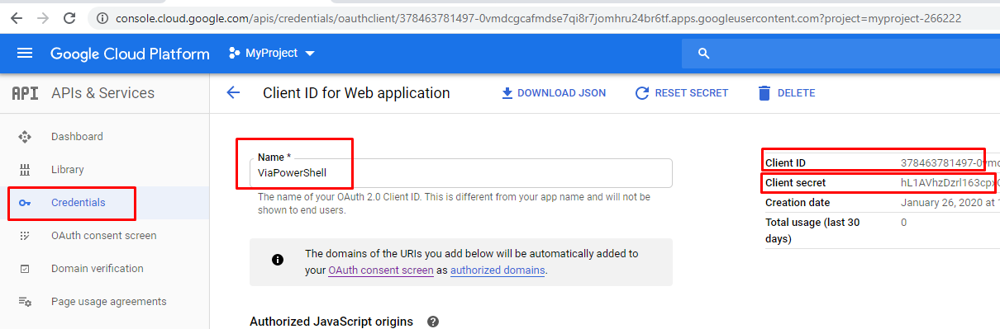
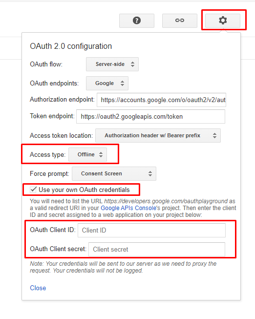

# Below you will find a short and detailed summary on how to set up your google contacts. 
- If you set up this option, your reports will be more richer with contact names information. Highly recommended!

# Summary: 
## Steps to create a Google project and ClientID and ClientSecret
1. Create a Google project.
2. Enable Contacts API.
3. Create oAuth credentials i.e. Client ID and Client Secret keys
4. Save the keys as a JSON file in your Secrets directory (this folder).
    - You dont have to rename the long file name (but if you want, you can. Just dont change the file extension. Keep it as .json).
    - All the files in Secrets directory (Except readme.md) are ignored. So you dont have to worry about accidentally publishing it on say github.
    - Thus your secrets are safe on your computer (as long as your computer is safe from viruses i.e.)
    - Do not add any other file here (atleast not a json file).
5. Using your clientId and Client secret Key, get a refresh token (Detailed steps are given below) .
    - Add this refresh token to your secrets json file with a key value pair 
    - looks like this (updated with dummy values): "refresh_token": "1//04abcdefghijklmopqurstuv-abcdefghijklmopqurstuv_zydfsfsdfsfsdfsdfdsfsnT68",)
    - Later goal is to eliminate this step, so that you can just work with client id and client secret. Until then use this.
6. To ensure that all your phone contacts are synced on google contacts, sync your contacts with google contacts. 
    - If you are on Iphone, follow this one time instructions to [sync your contacts from icloud to google contacts](https://www.tomsguide.com/us/import-iphone-contacts-into-gmail,news-21221.html)
    - If you are on android, checkout how to sync your contacts manually to google contacts (there are many videos on youtube. I dont have android so cant test this.)

# Detailed: 
## Step by step instructions.
1. ___[Create a google project](https://console.cloud.google.com/cloud-resource-manager)___

    
    
    
--------
2. ___Enable Contacts API___ 

    
    
    
    
    
--------
3. ___Create Credentials (oAuth keys:  Client ID and Client Secret keys)___
    __Either from the ContactsAPI page as shown below.___
    
    
    
    
    
    
    
    
    
    
    
    __You can also view this anytime from the credentials page (or even set up from there as shown below)___
    
    
    
--------
4. ___Save the keys as a JSON file in your Secrets directory (this folder).___

    
    
    
    
--------
5. ___Get a refresh token using client id and client secret and add to secrets json file.___
    * [Navigate to Google oauthplayground](https://developers.google.com/oauthplayground/ )
    - Go to settings and check option "use your own OAuth credentials". Provide your client Id and client Secret and Close. [Curtesy reference](https://monteledwards.com/2017/03/05/powershell-oauth-downloadinguploading-to-google-drive-via-drive-api/)
    
    
    * [Set a redirect URI (needed for step in getting indefinite refresh tokens)](https://developers.google.com/identity/protocols/OpenIDConnect#setredirecturi) 
    - Select the contact-> and API for scope.
    - Exchange the authentication code for tokens.
    - Copy the refreh token from here and add to client-secret_****.json
    - Say add below  "client_secret": "abcdedfghijklmnopqur", as
                      "refresh_token": "1//04uYuNrwL0oN5CgYIARAAGAQSNwF-L9Irr8KeDh3g3yBOl6erDwSWKQPn_cJOfU2YwkRak5rqRZ7PRCr38CXOpi6xmjXaKSknT68",
    - Save and close. 
--------
6. ___Sync all your icloud contacts to google contacts.___
    * If for some reason, link on summary section, didnt open, below is pdf instructions of the same html page:
    [Import-iphone-contacts-into-gmail](../ExternalModules/GoogleAPIs/Import-iphone-contacts-into-gmail.pdf)
    - You are good to go with your setup! 
--------

# Reference
* [How to insert images in github readme.md files](https://youtu.be/hHbWF1Bvgf4)
* [Solution to get Names-Numbers](https://www.reddit.com/r/PowerShell/comments/7ax36a/powershell_and_google_contacts_api/)

# To generate authentication tokens manually, use this website
* [To create your google project](https://console.cloud.google.com/cloud-resource-manager)
* [To create your oAuth keys: Client ID and Client Secret](https://developers.google.com/identity/protocols/OpenIDConnect#getcredentials)
* [To get Refresh tokens (Indefinite duration)](https://monteledwards.com/2017/03/05/powershell-oauth-downloadinguploading-to-google-drive-via-drive-api/)

# Google Developers
* [Google oauthplayground](https://developers.google.com/oauthplayground/ )
    * [A how to video on working with Google oauthplayground](https://www.youtube.com/watch?v=nRF_HdrYeGE ) 
* [People API Get URLs for contact details](https://developers.google.com/people/api/rest/v1/people/get) 

# Powershell scripts to work with oAuth tokens
* [Install-Module -Name GoogleOAuth2](https://www.powershellgallery.com/packages/GoogleOAuth2/1.0.1.0)

    